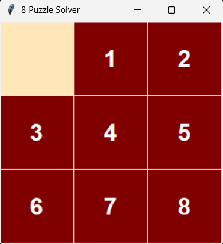

# 8-Puzzle Solver Using Search Algorithms

## Artificial Intelligence Course - Assignment 1

**Alexandria University**  
**Faculty of Engineering**  
**Computer and Communications Program**

---

## Overview

This project implements different Artificial Intelligence search algorithms to solve the classic **8-Puzzle problem**.

The objective is to find a sequence of moves that transforms an initial puzzle configuration into the goal state:

```
0 1 2
3 4 5
6 7 8
```

The empty space is represented by `0`.

A legal move consists of swapping the empty space with an adjacent tile:

- Up
- Down
- Left
- Right

The cost of every move is equal to **1**, so the total path cost is the number of moves required to reach the goal state.

---

# Implemented Algorithms

This project implements the following search algorithms:

## 1. Breadth First Search (BFS)

Breadth First Search explores the search space level by level.

### Properties:

- Complete
- Optimal for equal step costs
- Uses a queue data structure
- Finds the shortest path

---

## 2. Depth First Search (DFS)

Depth First Search explores one branch as deeply as possible before backtracking.

### Properties:

- Uses a stack data structure
- Requires less memory than BFS
- Does not guarantee the optimal solution

---

## 3. Iterative Deepening Depth First Search (IDDFS)

IDDFS combines the advantages of BFS and DFS.

It repeatedly performs DFS with increasing depth limits:

```
Depth limit = 0
Depth limit = 1
Depth limit = 2
Depth limit = 3
...
```

### Properties:

- Complete
- Optimal
- Memory efficient

---

## 4. A\* Search Algorithm

A\* is an informed search algorithm that uses:

```
f(n) = g(n) + h(n)
```

Where:

- `g(n)` = cost from the initial state to the current state
- `h(n)` = estimated cost from the current state to the goal state

The algorithm uses a priority queue to always expand the node with the lowest estimated total cost.

---

# Heuristics Used in A\*

Two heuristic functions were implemented and compared:

---

## Manhattan Distance

The Manhattan heuristic calculates the sum of horizontal and vertical distances of every tile from its goal position.

Formula:

```
h(n) = |current_x - goal_x| + |current_y - goal_y|
```

### Advantages:

- Admissible heuristic
- Never overestimates the actual cost
- More accurate for grid-based movement
- Usually expands fewer nodes

---

## Euclidean Distance

The Euclidean heuristic calculates the straight-line distance between a tile's current position and its goal position.

Formula:

```
h(n) = sqrt((current_x - goal_x)^2 + (current_y - goal_y)^2)
```

### Advantages:

- Valid heuristic
- Provides an estimate of the remaining distance

---

# Heuristic Comparison

For the 8-puzzle problem, the **Manhattan Distance heuristic is more effective** because:

- Tiles can only move horizontally or vertically.
- Diagonal movement is not allowed.
- Manhattan distance gives a tighter estimate.
- It remains admissible while usually expanding fewer nodes.

Therefore, A* with Manhattan distance generally performs better than A* with Euclidean distance.

---

# Project Structure

```
8-Puzzle-AI-Solver/

│
├── BFS.py
│   ├── Puzzle representation
│   ├── Node class
│   ├── BFS implementation
│   ├── Puzzle utilities
│   └── Visualization functions
│
├── dfs.py
│   ├── DFS implementation
│   └── Iterative DFS implementation
│
├── astar.py
│   ├── A* implementation
│   ├── Manhattan heuristic
│   └── Euclidean heuristic
│
├── README.md
│
└── screenshot.png (optional)
```

---

# Features

## Puzzle Generation

The program can generate random puzzle configurations.

It includes a solvability checker using inversion counting to ensure that generated puzzles have valid solutions.

---

## Solution Path Reconstruction

The program records:

- Sequence of moves
- States from initial state to goal state
- Path cost
- Search depth

---

## Performance Measurements

For every algorithm, the program reports:

- Solution path
- Cost of path
- Search depth
- Number of expanded nodes
- Running time

---

## Puzzle Visualization

A graphical visualization is implemented using **Tkinter**.

The solution is displayed step-by-step as an animation.

Example:

```
Initial State:

1 2 5
3 4 0
6 7 8


Solution:

1 2 5
3 0 4
6 7 8

...

0 1 2
3 4 5
6 7 8
```

---

## Visualization Screenshot

The solver includes a graphical visualization using Tkinter that displays the solution path step-by-step.



# Technologies Used

- Python 3
- Artificial Intelligence Search Algorithms
- Queue
- Stack
- Priority Queue
- Tkinter GUI

---

# Requirements

Python 3.x

Required libraries:

```
heapq
math
time
random
collections
itertools
tkinter
```

Most libraries are included with Python by default.

---

# How to Run

Clone the repository:

```bash
git clone https://github.com/your-username/8-Puzzle-AI-Solver.git
```

Navigate to the project folder:

```bash
cd 8-Puzzle-AI-Solver
```

---

## Run BFS

```bash
python BFS.py
```

---

## Run DFS / IDDFS

```bash
python dfs.py
```

---

## Run A\*

```bash
python astar.py
```

---

# Sample Output

Example:

```
Success :)

Path:
['Left', 'Up', 'Right']

Cost:
3

Nodes Expanded:
25

Search Depth:
3

Running Time:
0.002 seconds
```

---

# Algorithm Data Structures

| Algorithm | Data Structure            |
| --------- | ------------------------- |
| BFS       | Queue                     |
| DFS       | Stack                     |
| IDDFS     | Stack + Depth Limit       |
| A\*       | Priority Queue (Min Heap) |

---

# Complexity Comparison

| Algorithm | Complete | Optimal                         | Data Structure |
| --------- | -------- | ------------------------------- | -------------- |
| BFS       | Yes      | Yes                             | Queue          |
| DFS       | No       | No                              | Stack          |
| IDDFS     | Yes      | Yes                             | Stack          |
| A\*       | Yes      | Yes (with admissible heuristic) | Priority Queue |

---

# Example Initial State

The program can solve any solvable random configuration.

Example:

```
1 2 5
3 4 0
6 7 8
```

Goal:

```
0 1 2
3 4 5
6 7 8
```

---

# Author

**Shams Saied**

Computer and Communications Engineering Student  
Alexandria University
